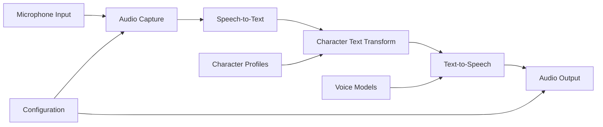
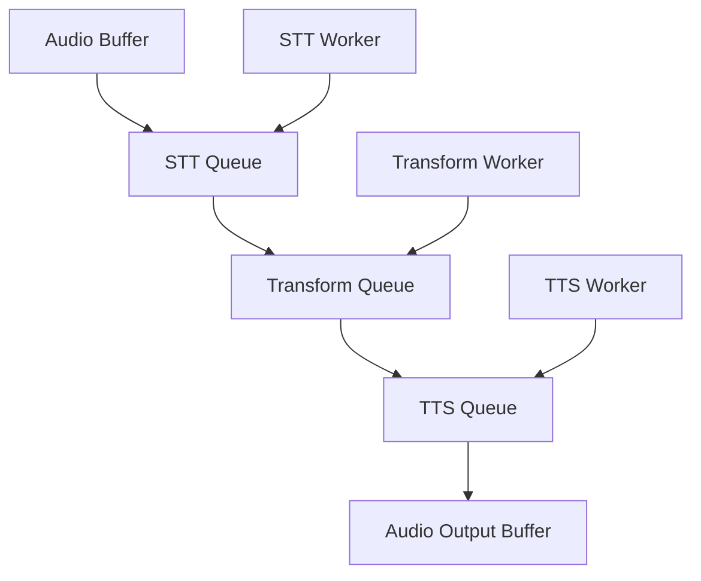

# Design Document

## Overview

The Real-Time Voice Character Transformation system is a desktop application that processes audio input through a four-stage pipeline: Speech-to-Text (STT), Character Text Transformation, Text-to-Speech (TTS), and Audio Output. The system leverages local GPU acceleration for optimal performance and maintains modularity for easy extension with new character personas and voice models.

## Architecture

### High-Level Architecture



### Technology Stack

- **Framework**: Python with asyncio for concurrent pipeline processing
- **Speech-to-Text**: OpenAI Whisper (local inference via faster-whisper)
- **Character Transformation**: Local LLM (Llama 3.1 8B or similar via llama.cpp)
- **Text-to-Speech**: Coqui TTS or XTTS v2 for local voice cloning
- **GPU Acceleration**: CUDA for all AI model inference
- **Audio Processing**: PyAudio for real-time audio I/O
- **UI Framework**: Tkinter or PyQt for cross-platform desktop GUI

### Pipeline Architecture

The system uses an asynchronous pipeline with buffering between stages to minimize latency:



## Components and Interfaces

### 1. Audio Capture Module

**Purpose**: Captures microphone input and manages audio streaming

**Key Classes**:
- `AudioCapture`: Handles microphone input with configurable sample rates
- `AudioBuffer`: Circular buffer for real-time audio processing
- `VoiceActivityDetector`: Detects speech segments to trigger processing

**Interface**:
```python
class AudioCapture:
    def start_capture(self, device_id: int, callback: Callable)
    def stop_capture(self)
    def get_available_devices(self) -> List[AudioDevice]
    def set_sensitivity(self, threshold: float)
```

### 2. Speech-to-Text Module

**Purpose**: Converts audio to text using local Whisper model

**Key Classes**:
- `WhisperSTT`: Wrapper for faster-whisper inference
- `STTProcessor`: Manages model loading and inference queue

**Interface**:
```python
class WhisperSTT:
    def __init__(self, model_size: str = "base", device: str = "cuda")
    async def transcribe(self, audio_data: np.ndarray) -> str
    def load_model(self)
    def unload_model(self)
```

### 3. Character Transformation Module

**Purpose**: Transforms text to match character speaking styles

**Key Classes**:
- `CharacterTransformer`: Main transformation logic
- `CharacterProfile`: Defines character traits and transformation rules
- `LLMProcessor`: Handles local LLM inference

**Interface**:
```python
class CharacterTransformer:
    def __init__(self, llm_model_path: str)
    async def transform_text(self, text: str, character: CharacterProfile) -> str
    def load_character(self, character_name: str) -> CharacterProfile
    def get_available_characters(self) -> List[str]
```

### 4. Text-to-Speech Module

**Purpose**: Generates speech audio from character-styled text

**Key Classes**:
- `CoquiTTS`: Local TTS inference engine
- `VoiceModel`: Represents a character voice model
- `TTSProcessor`: Manages TTS queue and audio generation

**Interface**:
```python
class CoquiTTS:
    def __init__(self, model_path: str, device: str = "cuda")
    async def synthesize(self, text: str, voice_model: VoiceModel) -> np.ndarray
    def load_voice_model(self, model_path: str) -> VoiceModel
    def get_available_voices(self) -> List[VoiceModel]
```

### 5. Pipeline Orchestrator

**Purpose**: Coordinates the entire processing pipeline

**Key Classes**:
- `VoicePipeline`: Main orchestrator class
- `PipelineStage`: Abstract base for pipeline components
- `PipelineMetrics`: Performance monitoring and latency tracking

**Interface**:
```python
class VoicePipeline:
    def __init__(self, config: PipelineConfig)
    async def start_pipeline(self)
    async def stop_pipeline(self)
    def set_character(self, character_name: str)
    def get_pipeline_status(self) -> PipelineStatus
```

## Data Models

### Character Profile

```python
@dataclass
class CharacterProfile:
    name: str
    description: str
    personality_traits: List[str]
    speech_patterns: Dict[str, str]
    vocabulary_preferences: Dict[str, List[str]]
    transformation_prompt: str
    voice_model_path: str
    intensity_multiplier: float = 1.0
```

### Pipeline Configuration

```python
@dataclass
class PipelineConfig:
    audio_device_id: int
    sample_rate: int = 16000
    chunk_size: int = 1024
    stt_model_size: str = "base"
    llm_model_path: str
    tts_model_path: str
    gpu_device: str = "cuda"
    max_latency_ms: int = 2000
```

### Audio Processing

```python
@dataclass
class AudioChunk:
    data: np.ndarray
    timestamp: float
    sample_rate: int
    duration_ms: float
```

## Error Handling

### Error Categories

1. **Hardware Errors**: GPU unavailable, audio device issues
2. **Model Loading Errors**: Corrupted models, insufficient VRAM
3. **Processing Errors**: Inference failures, timeout errors
4. **Configuration Errors**: Invalid settings, missing files

### Error Recovery Strategies

- **Graceful Degradation**: Fall back to CPU inference if GPU fails
- **Retry Logic**: Automatic retry for transient failures with exponential backoff
- **User Notification**: Clear error messages with suggested solutions
- **Logging**: Comprehensive logging for debugging and monitoring

### Error Handling Implementation

```python
class PipelineError(Exception):
    def __init__(self, stage: str, message: str, recoverable: bool = True):
        self.stage = stage
        self.message = message
        self.recoverable = recoverable
        super().__init__(f"{stage}: {message}")

class ErrorHandler:
    async def handle_error(self, error: PipelineError) -> bool:
        # Log error, attempt recovery, notify user
        pass
```

## Testing Strategy

### Unit Testing

- **Audio Processing**: Mock audio input/output for deterministic testing
- **Model Inference**: Test with known inputs and expected outputs
- **Character Transformation**: Validate transformation logic with sample texts
- **Configuration Management**: Test settings persistence and validation

### Integration Testing

- **Pipeline Flow**: End-to-end testing with synthetic audio inputs
- **Performance Testing**: Latency measurement under various loads
- **Error Scenarios**: Simulate failures at each pipeline stage
- **Character Switching**: Test dynamic character profile loading

### Performance Testing

- **Latency Benchmarks**: Measure processing time for each pipeline stage
- **Memory Usage**: Monitor VRAM and RAM consumption
- **Concurrent Processing**: Test multiple simultaneous audio streams
- **Model Loading**: Benchmark model initialization times

### Test Data

- **Audio Samples**: Curated set of test audio files with known transcriptions
- **Character Profiles**: Test character definitions with expected transformations
- **Voice Models**: Sample voice models for TTS validation
- **Configuration Files**: Test configurations for various hardware setups

### Automated Testing

```python
class PipelineTestSuite:
    def test_stt_accuracy(self):
        # Test speech recognition accuracy
        pass
    
    def test_character_transformation(self):
        # Validate character-specific text changes
        pass
    
    def test_tts_quality(self):
        # Verify audio output quality
        pass
    
    def test_end_to_end_latency(self):
        # Measure total pipeline latency
        pass
```

## Performance Optimization

### GPU Memory Management

- **Model Quantization**: Use 4-bit or 8-bit quantized models where possible
- **Memory Pooling**: Reuse GPU memory allocations between inferences
- **Batch Processing**: Process multiple audio chunks together when possible
- **Model Offloading**: Dynamically load/unload models based on usage

### Latency Optimization

- **Streaming Processing**: Process audio in overlapping chunks
- **Predictive Loading**: Pre-load likely next character profiles
- **Parallel Processing**: Run STT and previous TTS generation concurrently
- **Audio Buffering**: Maintain output buffer to smooth playback

### Hardware Utilization

- **Multi-GPU Support**: Distribute models across available GPUs
- **CPU Fallback**: Automatic fallback for non-critical components
- **Memory Monitoring**: Dynamic adjustment based on available resources
- **Thermal Management**: Monitor GPU temperatures and adjust processing